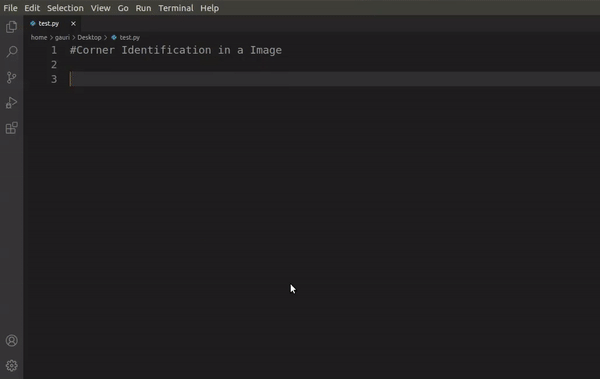
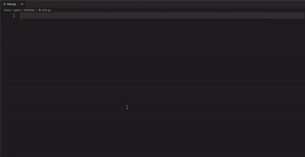

# Opencv Snippets for Vs Code

This Vs Code extension provides the user with [Opencv](https://opencv.org/) snippets in python. It helps in effectively providing, refactoring and editing the opencv projects in python3. All the snippets starts with **"o"**, so typing a letter **o** gives recommendation for all the available opencv snippets.<br />
Example -
> This Example detects corner in the image. <br />

<br />

> This Example detects shapes in the image.<br />

<br />

From the examples above, it can be easily seen that how easy and fast it become to code in Opencv by using this extension. It also saves you from any syntactical mistakes and increase your coding speed by many folds.   

## Installation:

This Extension can be installed from the Visual Studio Code Marketplace or by searching within VS Code. 
> In VS code press ctrl+p and type **ext install extensionName** and press enter.

## Snippets:

| **Trigger** | **Full Form** | **Description** |
| --- | --- | --- |
| **orimg** | Reading Image | Reads image from the computer |
| **owimg** | Write Image | Write image in the computer |
| **odis** | Display Image | Display Image |
| **orvid** | Read Video | Read Video from camera or a Video File |
| **owvid** | Write Video | Write Video in the computer |
| **oline** | Draw Line | Draw Line on the image |
| **oaline** | Draw Arrowed Line | Draw arrowed line on the image |
| **orect** | Draw Rectangle | Draw Rectangle on the image |
| **ocircle** | Draw Circle | Draw Circle on the image |
| **oellipse** | Draw Ellipse | Draw Ellipse on the image |
| **opoly** | Draw Closed Polygon | Draw any Polygon on the image |
| **otext** | Write Text | Put any text on the image |
| **olistevents** | Listing Events | List all the events available in opencv |
| **ohmevent** | Handling Mouse Events | Provide basic Layout to handle all mouse events |
| **octrack** | Create Trackbar | Creates trackbar on any window |
| **otrackpos** | Get Trackbar Position | Gives the position of trackbar at any time |
| **ocvtcolor** | Convert Color | Converts color from one format to other |
| **ohsvcoloriden** | Identify Color using HSV | Identifies any color in the image |
| **othresh** | Thresholding | Returns a threshold Image |
| **oathresh** | Adaptive Thresholding | Returns Adaptive thresholded Image |
| **odilate** | Dilate Image | Returns a Dilated image |
| **oerode** | Erode Image | Returns a Eroded image |
| **omorphex** | Morphological Transformations | Removes noises from the image by performing morphological transformations on it. |
| **oblur** | Blur Image | Used for blurring or smoothening of image |
| **ogblur** | Gaussian Blur | Returns Gaussian blur of a image |
| **omedblur** | Median Blur | Used for smoothening of image using Median blur |
| **obblur** | Bilateral Blur | Used for smoothening of image using Bilateral blur |
| **olapedge** | Laplacian Edge Detector| Edge Identification using Laplacian Edge Detector |
| **osobedge** | Sobel Edge Detector| Edge Identification using Sobel Edge Detector |
| **ocanny** | Canny Edge Detector| Edge Identification using Canny Edge Detector |
| **ocontours** | Contours | Identifies and draw contours on the image |
| **oshapedetect** | Shape Detection | Detects shapes present in the image and writes the name of the shape in the image. |
| **omatchtem** | Template Matching | Matches template in any main image and draws rectangle around the identified template in the main image |
| **ohough** | Hough Line Transformation | Detects straight lines of infinite length in the image. |
| **ophough** | Probabilistic Hough Line Transform | Detects straight lines of finite length in the image. |
| **ohaarc** | Haar Cascades Classifier| Provide Layout for using Haar Cascades Classifier |
| **oharrisc** | Harris Corner Detector | Detects corner in the Given image (Harris Corner Detector) |
| **ogoodf** | Shi-Tomasi Corner Detector | Detects desired number of corners in the Given image (Shi-Tomasi Corner Detector) |
| **opers** | Perspective Transformation | Returns the perspective transformation of the image |
| **oaffn** | Affine Transformation | Returns the Affine Transformation of the image |
| **orotate** | Rotate Image | Rotates the image by desired angle |

## Requirements

- Python3 should be installed in the system.
> For installing python latest version you can head over to [python offcial website](https://www.python.org/).
- Opencv library of python. This can be installed by executing the following command in the terminal or cmd.
```bash
    pip install opencv-python
```
- Numpy library of python. This can be installed by executing the following command in the terminal or cmd.
> This need not be compulsorily installed but it is advised to install it because there are various snippets which require this library for better and smooth performance.
```bash
    pip install numpy
```    

## Issues

Report issues and bugs at [Opencv Snippets Issues](https://github.com/gsGupta11/vscode-OpencvSnippets/issues)

## Release Notes

The detailed release notes of Opencv Snippets can be found at -
- [Opencv Snippets Release Notes](https://github.com/gsGupta11/vscode-OpencvSnippets/blob/master/CHANGELOG.md) 

### v1.2.2
- Bug fixes.
- Keywords added.
- Added more snippets.

### v1.2.1
- Improvements and bug fixes.
- Code cleaned to make it more readable.
- Comments added.

### v1.2.0
- More Snippets added.
- Better handling of triggers.
- Code quality improvements.
- Code should run faster now.

### v1.1.2
- Reformating of code.
- Minor bug fixes.

### v1.1.1
- Added gifs and icons.
- readme prepared.

### v1.1.0
- Added Multiple Snippets.
- Snippets made more generic.
- Code modularized.

### v1.0.0
- Initial Release of Opencv-Snippets 
    * Basic Layout of the project setup
    * Added Image and Video read/write snippets.


-----------------------------------------------------------------------------------------------------------
## License
Opencv Snippets is an open-sourced software licensed under the [GNU GENERAL PUBLIC LICENSE](https://github.com/gsGupta11/vscode-OpencvSnippets/blob/master/LICENSE).

## About Me

- You can connect with me at linkedin:
> [Linkedin-ID](https://www.linkedin.com/in/gauri-shankar-gupta-3661aa179/)
- You can follow me on github:
> [github-profile](https://github.com/gsGupta11)

### For more information

This is a open Source project, so for more information and contribution you can checkout:
- [Opencv Snippets](https://github.com/gsGupta11/vscode-OpencvSnippets) 

**Enjoy!**
